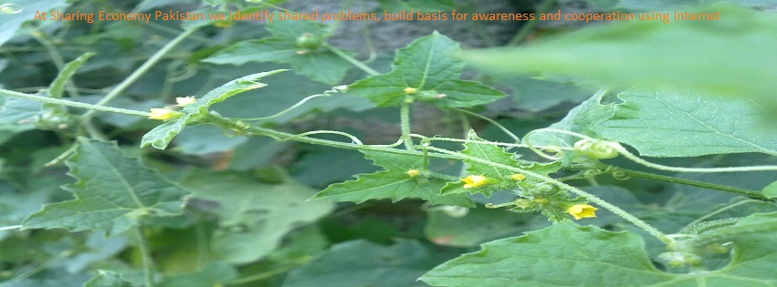

### Hi there 👋

We started this project in March of this year, then Covid19 happened. Our families found themselves in the center of all that is bad due to Covid19. We had to stop and just survive and keep our loved ones safe and healthy. Our struggle is still going on. We'll get to our regular lives and to this project as soon as this SHIT-SHOW is over.

<!--
**sharingeconomypakistan/sharingeconomypakistan** is a ✨ _special_ ✨ repository because its `README.md` (this file) appears on your GitHub profile.

Here are some ideas to get you started:

- 🔭 I’m currently working on ...
- 🌱 I’m currently learning ...
- 👯 I’m looking to collaborate on ...
- 🤔 I’m looking for help with ...
- 💬 Ask me about ...
- 📫 How to reach me: ...
- 😄 Pronouns: ...
- ⚡ Fun fact: ...
-->

<!--
At **Sharing Economy Pakistan** we identify shared problems, build basis for awareness and cooperation using Internet.
-->

